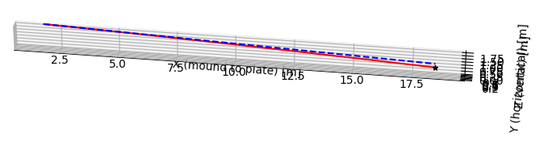

# BSB_PLAYGROUND

For learning about & playing with MLB stats via PyBaseball API.

## Hello world
`kyle_cgso81.py` Some visualizations of pitches thrown by Kyle Hendricks in his May 3, 2019 complete game shut out of the Cardinals.

## Pitch trajectory simulation
`pitch_trajectories_sim.py` Toy simulation of pitch trajectories considering release velocity, spin, Magnus force, drag force and gravity. (Unsure whether it is realistic) with help from ChatGPT

Example result:

Takeaway: the physics-based model captures the general movement of different pitch grips. However, it fails to capture some details.
For example, MLB pitches may have very late break so that all pitches look as similar as possible coming out of pitcher's hand and in the early stage of the trajectory.
Some weakness of this model may be: (1) assumption of constant spin (2) no fitting process for model parameters among others.

`sim_vs_statcast.py` Visualize & compare:
* trajectories simulated using the physics mentioned above vs.
* StatCast acceleration values which also considers all those factors and approximates a constant acceleration.

Comparison of physics-based simulated vs. StatCast approximated trajectories in one example (sinker):

Red solid line is StatCast-approximated trajectory. Blue dashed line is simulated trajectory using release location, velocity and spin.
The actual spot where ball crossed the zone is marked by the black dot.

Comparison of physics-based simulated vs. StatCast approximated zone spot errors (StatCast `plate_x, plate_z`) as ground truth:

Needless to say, current physics-based model is ass.
